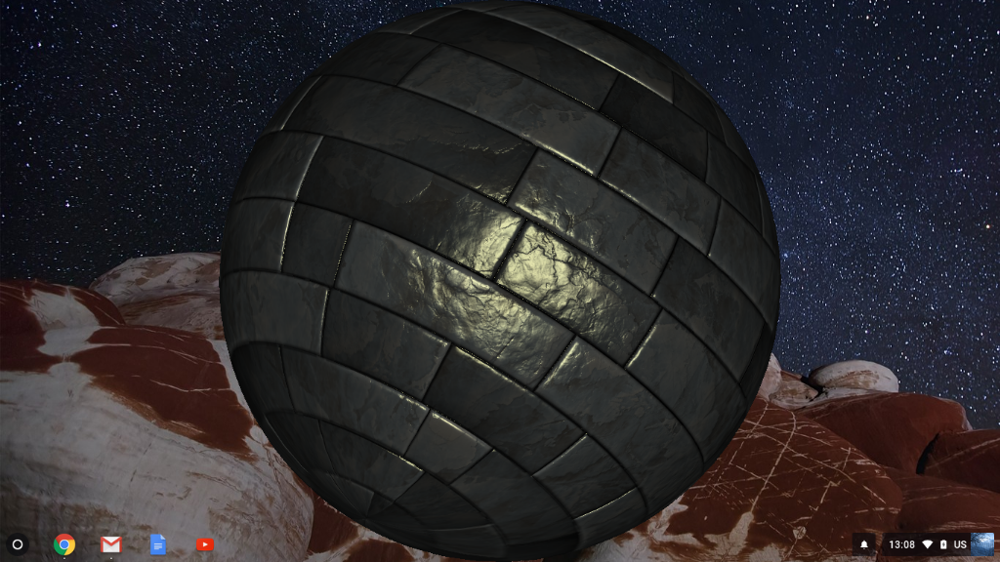
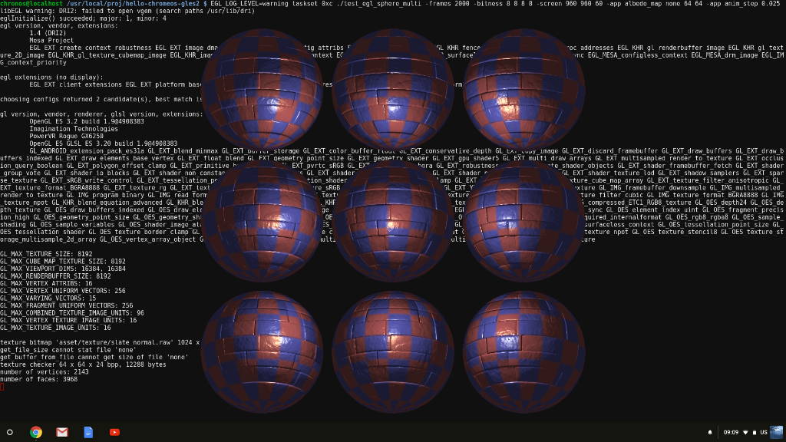

Description
-----------

This is an experiment in self-hosted ChromeOS development focused on OpenGL ES. It relies on the ChromeOS-native GLESv2/EGL/Wayland stacks and as such should run on any ChromeOS device meeting the prerequisites, irrespective of [Crouton](https://github.com/dnschneid/crouton) conditions.

*Warning:* as of R69 RK3399-based chromebooks suffer from a system-wide (incl. not unmountig the filesystem) crash upon exiting the app -- see [ticket #4](https://github.com/blu/hello-chromeos-gles2/issues/4).



Prerequisites
-------------

* A ChromeOS device in developer mode.
* ChromeOS revision with support for DRM render nodes, and a functioning Wayland server -- both found on ChromeOS revisions with support for Android apps, e.g. R67.
* [Chromebrew](https://github.com/skycocker/chromebrew)

The following Chromebrew packages are required:

* buildessential (a meta package that may or may not include some or all of the follwing packages at the time of reading)
* gcc10
* wayland
* wayland_protocols
* linuxheaders


How to Build
------------

Before you can build any of the applications you have to run `build_wayland_protocols.sh` in the source directory in order to generate the code for the required auxiliary wayland protocols. It is recommended to repeat that step after every update of Chromebrew package `wayland_protocols`.

Running one of the `build_chromeos_xxx.sh` scripts in the source directiory builds the respective `test_egl_xxx` executable. Currently the compiler is hard-coded to gcc/g++.


Tips
---------------

All test apps follow a common CLI scheme of universal args and app-specific args:
```
usage: ./test_egl_sphere [<option> ...]
options:
        -frames <unsigned_integer>              : set number of frames to run; default is max unsigned int
        -screen <width> <height> <Hz>           : set framebuffer of specified geometry and refresh
        -bitness <r> <g> <b> <a>                : set framebuffer RGBA bitness; default is screen's bitness
        -fsaa <positive_integer>                : set fullscreen antialiasing; default is none
        -drawcalls <positive_integer>           : set number of drawcalls per frame; may be ignored by apps
        -device <unsigned_integer>              : device index in /dev/dri/cardN sequence
        -app <option> [<arguments>]             : app-specific option
```

Example of CLI usage:
```
$ LD_LIBRARY_PATH=/usr/lib:/usr/local/lib XDG_RUNTIME_DIR=/run/chrome EGL_LOG_LEVEL=warning ./test_egl_xxx -frames 2000 -bitness 8 8 8 8 -screen 640 640 60
```

The above:

* Makes sure factory-supplied libraries are preferred over chromebrew-supplied ones (via 'LD_LIBRARY_PATH' envvar).
* Tells libwayland-client where to find wayland sockets (via 'XDG_RUNTIME_DIR' envvar).
* Sets the libEGL diagnostics to 'warnings-only' (via 'EGL_LOG_LEVEL' envvar).
* Specifies 2000 frames worth of runtime.
* Specifies framebuffer pixel format of RGBA8888 (others supported are RGBA8880 and RGBA5650).
* Specifies framebuffer geometry of 640x640x60Hz (refresh is required yet conveniently ignored).

Notes:

* You may need superuser privileges to use the export-buffer DRI functionality, used for on-screen presentation of our framebuffer.
* On platforms with multiple /dev/dri/cardN devices, some of those may deny creation of 'dumb' DRM buffers, which makes such devices useless to us.
* Resizing at runtime, including switching to fullscreen, is not supported.

References
----------

* Jan Newmarch [Programming Wayland Clients](https://jan.newmarch.name/Wayland/)
* Henrique Dante de Almeida [The Hello Wayland Tutorial](https://hdante.wordpress.com/2014/07/08/the-hello-wayland-tutorial/)


